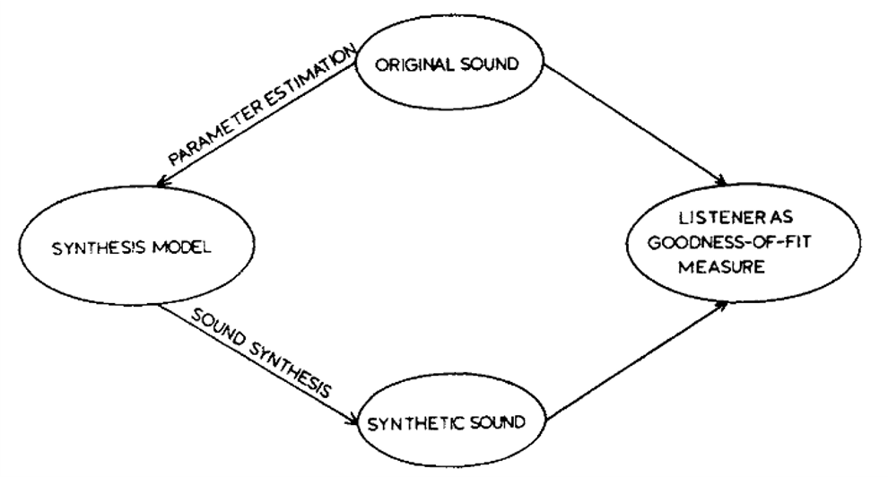
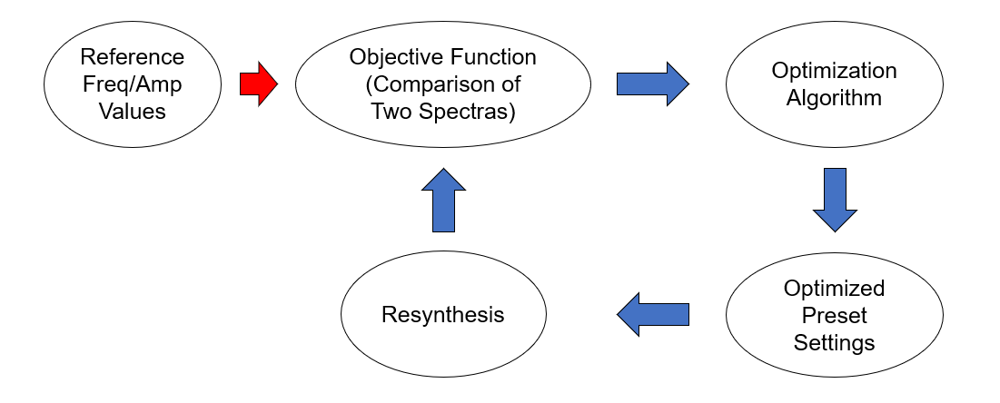

# FFTimbre

FFTimbre is a small toolkit of notebooks and helpers for spectral matching with FM/additive synthesis. It started as an exploratory idea inside https://github.com/egorpol/audiospylt and has since grown into its own project.

This setup was introduced in a talk at the InMusic'24 conference (Oslo). Slides are available in `inmusic24_slides/`. A paper version is planned for the InMusic'24 proceedings (Routledge).

## Overview

The core question: how can we reproduce a target spectrum with a constrained oscillator setup? The initial motivation was to automatically derive settings for a Doepfer A‑100 modular configuration (mostly for fun), but it evolved into a general tool for resynthesizing spectra, with export to Ableton Operator in mind.

The approach is inspired by ideas from Risset & Wessel (1999), where a human judges the “goodness of fit” by comparing synthesized and original sounds. Here, we explore automated evaluation via spectral metrics and global optimizers.



## Features

- Multiple similarity metrics between target and generated spectra:
  - Itakura–Saito, Spectral Convergence, Cosine, Euclidean, Manhattan, KL, Pearson, MFCC distance
- Multiple optimizers to search synthesis parameters:
  - Differential Evolution (DE), Dual Annealing (DA), Basin Hopping (BH)
- Batch runner to sweep metrics/methods and save consistent outputs (WAV, plots, TSV)
- Clear, timestamped naming scheme for all artifacts



## Repository Structure

- `test.ipynb` — guided single‑run workflow (optimize + preview + save)
- `test_batch.ipynb` — batch examples over metrics/optimizers with consistent naming
- `py_scripts/`
  - `fm_synth_opt.py` — objective, synthesis, runners, plotting, I/O helpers
  - `optimization_workflow.py` — batch job utilities and naming integration
  - `objective_functions.py` — legacy/experimental objective prototypes
- `tsv/` — example target partials and saved final oscillator values
- `xml_presets/` — example preset files
- `rendered_audio/` — generated WAVs
- `rendered_plots/` — saved PNG plots from batch runs
- `rendered_gifs/` — optimizer animations
- `inmusic24_slides/` — conference slides (PDF/PPTX)
- `LICENSE` — MIT license

## Installation

Prerequisites: Python 3.10+ recommended.

```bash
pip install -r requirements.txt
```

Note on parallel processing: `workers` is supported by SciPy’s Differential Evolution (DE) only. Dual Annealing (DA) and Basin Hopping (BH) do not accept `workers`.

## Usage

- Open `test.ipynb` for a single end‑to‑end optimization on a target TSV. It will:
  - Load target partials from `tsv/*.tsv`
  - Optimize FM parameters
  - Save preview and optimized audio with informative filenames
  - Save TSV with final parameter values
- Open `test_batch.ipynb` to define a list of `(method, metric)` jobs and run them sequentially.

### Naming Scheme

All artifacts include the target name (derived from the TSV filename stem), method, metric, and a timestamp:

- Audio: `rendered_audio/optimized_output_fm_<target>_<method>_<metric>_<YYYYMMDD-HHMMSS>.wav`
- Plots: `rendered_plots/optimized_output_fm_<target>_<method>_<metric>_<YYYYMMDD-HHMMSS>_{time|spectrum|error}.png`
- TSV: `tsv/final_values_fm_<target>_<method>_<metric>_<YYYYMMDD-HHMMSS>.tsv`

## Metrics (recap)

- **Itakura–Saito**: Ratio/logarithmic comparison; sensitive to low‑energy regions.
- **Spectral convergence**: Normalized difference between magnitude spectra.
- **Cosine similarity**: Angular similarity of spectra.
- **Euclidean/Manhattan**: L2/L1 distances over spectral magnitudes.
- **Kullback–Leibler divergence**: Probabilistic divergence of spectral distributions.
- **Pearson correlation**: Linear correlation of spectral magnitudes.
- **MFCC distance**: Euclidean distance between mean MFCC vectors.

## License

MIT — see `LICENSE`.

